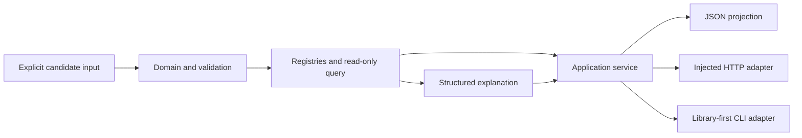

# CP-MoAKB

[](https://github.com/Adammetaa/CP-MoAKB/actions/workflows/ci.yml)

CP-MoAKB is **Explainable Agricultural Knowledge Infrastructure**: a governed,
deterministic, read-only Python platform for representing, validating, querying,
explaining, and projecting explicitly supplied knowledge records.

## Why it exists

Agricultural knowledge systems need traceable sources, stable identity, explicit
authority, and inspectable transformations before they can safely support more
advanced products. CP-MoAKB builds that engineering foundation. Its doctrine is
summarized as knowledge before intelligence, evidence before conclusion,
explainability before automation, determinism before convenience, and contracts
before code.

The permanent conceptual boundary is:

> Observation is not evidence; evidence is not knowledge; knowledge is not
> diagnosis; diagnosis is not recommendation; recommendation is not decision;
> decision is not action; action is not outcome.

## Current scope

The repository currently provides:

- immutable domain objects and constrained YAML adaptation;
- deterministic validation, registries, read-only query, and explanation;
- closed JSON projection and a transport-neutral application service;
- explicit composition with caller-supplied services;
- injected HTTP and library-first CLI adapters;
- governed packaging, security, compatibility, and release verification; and
- a retained legacy IRAC parsing/export path kept separate from Runtime Core.

Package `0.1.0` supports Python `>=3.11,<3.13` (3.11 and 3.12). The project is an alpha engineering
platform. No package release, GitHub Release, or release tag is created merely by
merging repository work.

## What it does not do

CP-MoAKB is not an agricultural diagnosis, recommendation, pesticide-selection,
ranking, confidence-scoring, AI, or LLM system. It is not a production web
service, database-backed application, complete knowledge corpus, or substitute
for experts, regulators, or agronomists. The installed distribution bundles no
usable agricultural knowledge base; examples are deliberately fictional.

## Architecture



Nothing in this flow discovers data, creates a default registry, opens a
database, or fetches a network resource. See the [architecture book](docs/architecture/README.md)
and [Runtime documentation](docs/runtime/README.md).

## Installation

The project is not represented here as published on PyPI. From a clone, create a
supported environment and install the local source:

```shell
python -m pip install .
python -m pip install ".[http]"  # only for HTTP integration
```

Contributors install the exact governed development set:

```shell
python -m pip install -r requirements-dev.txt
```

See [installation](docs/getting-started/installation.md) for editable and built
artifact paths.

## Quick start

This minimal offline example queries one fictional record through explicit
composition:

```python
from cpmoakb.adapters.yaml import load_candidate_yaml
from cpmoakb.application import QueryRecordsRequest
from cpmoakb.composition import create_runtime_application_service
from cpmoakb.explain import ExplanationService
from cpmoakb.query import QueryService

record = load_candidate_yaml("""schema_version: "1.0"
candidate_id: "CPM-CAND-E-990001"
record_kind: "entity"
domain_type: "SyntheticConcept"
lifecycle: "candidate"
labels:
  - language: "en"
    text: "Fictional Widget"
    status: "provisional"
    preferred: true
scope_note: "Synthetic quick-start record only."
provenance:
  creation:
    created_at: "2026-01-01"
    created_by: "synthetic-example-role"
""")
service = create_runtime_application_service(
    query_service=QueryService.from_records((record,)),
    explanation_service=ExplanationService(),
)
response = service.query_and_project(
    QueryRecordsRequest.from_values(label_text="Fictional Widget")
)
print(response.canonical_json)
```

The output is canonical JSON containing one traceable match; it contains no
recommendation or inferred conclusion. Continue with the
[quick start](docs/getting-started/quick-start.md).

## Examples

The [examples index](examples/README.md) covers minimal construction, querying,
query-and-explain, serialization, composition, HTTP injection, CLI embedding,
application embedding, deterministic testing, and extension boundaries. Every
executable example runs offline and is verified in CI.

## Documentation

Use the [documentation home](docs/README.md) to navigate by audience:

- [Getting started](docs/getting-started/quick-start.md)
- [Architecture](docs/architecture/README.md)
- [Public API handbook](docs/api/README.md)
- [Contributor handbook](docs/contributing/README.md)
- [Maintainer handbook](docs/maintainers/README.md)
- [Governance maps](docs/governance/README.md)
- [Knowledge Constitution and Authoring Standards](docs/knowledge/README.md)
- [Concepts and glossary](docs/concepts/README.md)
- [Release preparation](docs/release/README.md)

## Compatibility

| Surface | Version |
| --- | --- |
| Distribution | `0.1.0` |
| Runtime API | `0.1` |
| YAML schema | `1.0` |
| JSON projection | `1.0` |
| Application, HTTP, CLI, Composition APIs | `0.1` each |

These values are summarized for navigation; implementation constants and the
[public API manifest](docs/runtime/runtime-api-manifest.md) remain authoritative.

## Security, contributing, roadmap, and license

Report vulnerabilities privately as described in [SECURITY.md](SECURITY.md).
Development and governance expectations are in [CONTRIBUTING.md](CONTRIBUTING.md).
Current capability and future vision are separated in the
[project roadmap](docs/project/roadmap.md). Future knowledge authoring remains
subject to source, scientific, architecture, and product governance.

CP-MoAKB is licensed under [Apache-2.0](LICENSE).
