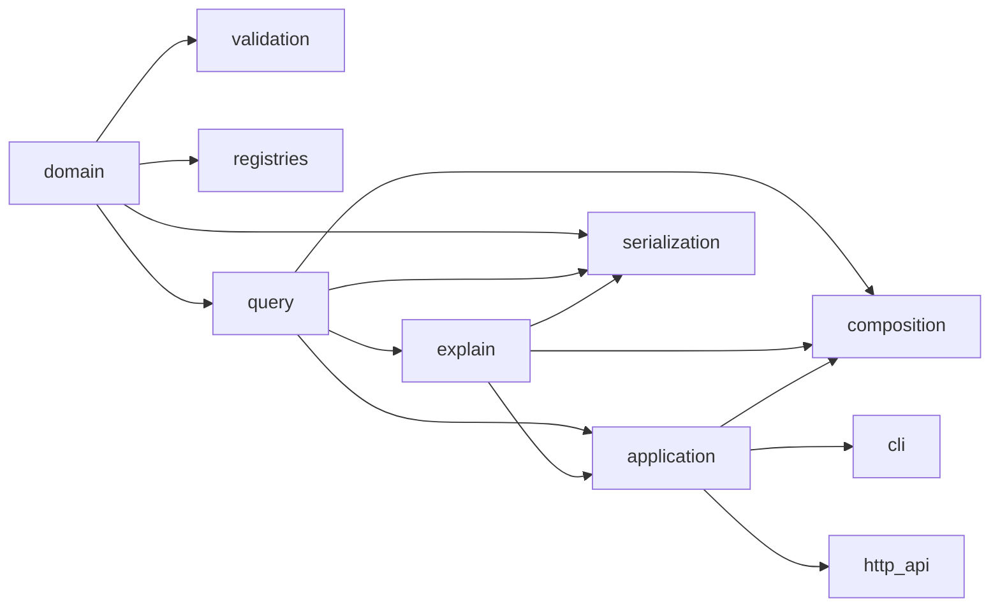

# Dependency Direction

Dependencies point inward toward stable values and outward through explicit
adapters:

Arrows mean “is depended on by” from left to right. Domain never imports a
transport, serializer, application facade, database adapter, or framework.
Transports call the application facade rather than query or serialization
internals. Composition imports approved public query, explanation, and application
surfaces only. Architecture tests and the security verifier guard these rules.
