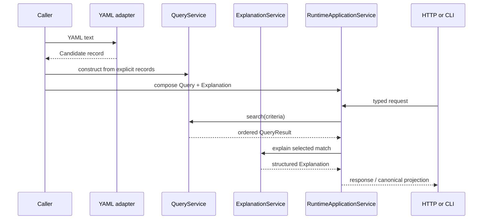

# Runtime Flow

The supported end-to-end flow is explicit and each operation remains independent:

Loading does not validate; validation does not register; registration does not
query; query does not explain; explanation does not recommend. The caller owns
the control flow and supplied state. See RAS-003 through RAS-011 and
`tests/contracts/test_end_to_end_pipeline.py`.
