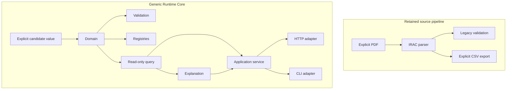

# System Overview

CP-MoAKB contains two deliberately separated areas: a retained source-oriented
IRAC pipeline and the generic Runtime Core. The parser turns an explicitly named
PDF into immutable legacy objects; export and SQLite building are separately
invoked legacy operations. Runtime Core accepts explicit candidate values and
provides storage-neutral contracts for validation, custody, query, explanation,
projection, application orchestration, and injected transports.

No automatic bridge connects these areas. Packaging includes code and the frozen
SQL schema needed by an explicitly invoked legacy builder, but no database or
knowledge base. Related authority: RAS-001 and RAS-012; coverage: architecture,
contract, legacy, and packaging tests.
