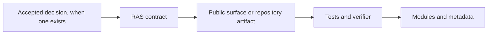

# Traceability Map

The preferred evidence chain is:

Examples: ADR-009 → RAS-003 → `cpmoakb.adapters.yaml` → adapter/contract tests →
adapter modules; RAS-007 → API manifest → static contract tests → package
`__all__`; RAS-012 → composition/metadata → packaging tests and artifact scripts →
`pyproject.toml` and `cpmoakb.composition`; RAS-013 → security/release policies →
security tests and verifiers → workflow and repository state.

RAS-008 through RAS-014 do not each claim a dedicated ADR. Their traceability
comes from earlier accepted architecture plus incremental governed contracts.
