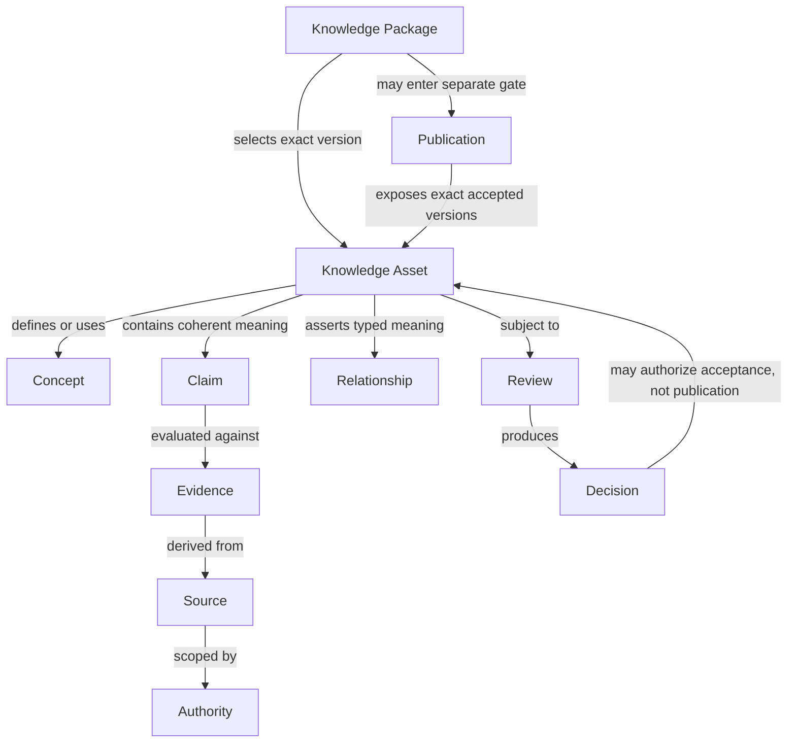

# Knowledge Asset and Package Model

Status: Active

Version: 1.0

## Purpose

Define the Knowledge Asset as the canonical object of governed meaning and the
Knowledge Package as a governed assembly of exact asset versions. This model is
conceptual and MUST NOT be interpreted as a schema, file format, class model,
database design, API contract, or Runtime contract.

## Authority

The Constitution governs epistemic and publication boundaries. KAS governs
authored meaning, evidence, citation, terminology, relationships, and lifecycle.
KGS governs people, decisions, ownership assignments, audit, and publication
authority. ADR-005 governs conceptual layers; ADR-006 governs identity
prerequisites; ADR-008 governs master-data sequencing and claim-scoped source
authority; ADR-009 alone governs the constrained Rice-pilot candidate YAML
profile. This model MUST NOT duplicate or generalize ADR-009.

## Knowledge Asset

A **Knowledge Asset** is the canonical, stable-identity, independently governed
object whose preserved versions carry one coherent unit of reviewed meaning.
Its identity persists while permitted labels, representations, repository
locations, and implementation technologies change.

An asset MUST make the following conceptual responsibilities reviewable without
prescribing fields:

- stable identity, identity category, owning authority, and accountable steward;
- intended meaning, scope, exclusions, applicability, and known limitations;
- contained concepts, claims, or relationship assertions that form its semantic
  nucleus;
- linked evidence, citations, sources, adverse material, and provenance;
- terminology and translation relationships without label-based identity;
- lifecycle, review state, publication state, and exact governing versions;
- conflicts, unresolved issues, exceptions, corrections, and supersession;
- references to related assets and external authorities;
- authorship, custody, review, decisions, ownership, and auditable history; and
- available representations and the exact Knowledge Version each expresses.

These responsibilities describe meaning that MUST survive any future mapping.
They are not a universal record layout. A future implementation MAY distribute
them across multiple governed objects if their identity, authority, traceability,
and equivalence remain explicit.

### Contained and Linked Objects

The semantic nucleus MAY contain concept definitions, bounded claims, and typed
relationship assertions when they form one coherent reviewable unit. Evidence,
sources, authorities, review findings, decisions, publications, and audit events
MUST retain their own identities and governance meaning even when a package or
representation displays them together.

An asset MUST NOT absorb an observation as an intrinsic fact, an evidence item
as a claim, a source authority as truth, a review as publication, or a
representation as canonical meaning. Materially independent meaning SHOULD have
independent asset identity so it can be cited, versioned, disputed, and retired
without rewriting unrelated knowledge.

### Identity, Versions, and History

The Knowledge Asset identity MUST be stable and non-reused. A Knowledge Version
MUST preserve one exact semantic state. Material change MUST create a successor
version; correction, split, merge, deprecation, supersession, and retirement
MUST preserve affected identities, rationales, predecessor links, and prior
versions. History MUST NOT be overwritten to make the current state appear
inevitable.

### Review and Publication State

Review state belongs to an exact asset version and records where that version is
in human governance. Publication state records whether an exact accepted version
has been included in an explicitly authorized knowledge release. Neither state
MUST be inferred from repository location, package membership, UI status, build
success, Runtime loadability, or public reachability.

### Ownership and Authority

Identity ownership, semantic stewardship, evidence custody, review authority,
package custody, and publication authority MAY belong to different competent
roles. Those responsibilities MUST be explicit and MUST NOT be collapsed into
file ownership or repository write access. Transfer of stewardship MUST preserve
identity, authority basis, effective boundary, and audit history.

### Knowledge Asset Non-goals

A Knowledge Asset is not a source file, database row, graph node, Python object,
YAML record, JSON object, web page, document, package archive, API response,
search result, diagnosis, recommendation, workflow action, or AI output. Any of
these MAY someday participate in a governed representation or implementation,
but none defines canonical identity or knowledge merely by existing.

## Conceptual Object Graph

Each arrow has declared meaning and MUST NOT imply ownership, truth,
transitivity, causation, acceptance, or publication beyond its label. Evidence,
source, authority, review, decision, and publication remain independently
identified governance objects rather than nested proof tokens.

## Knowledge Package

A **Knowledge Package** is a stable-identity, purpose-bounded assembly that
selects exact Knowledge Asset versions and connects the governance evidence
needed to review, transfer, freeze, release, or archive that assembly. A package
MUST declare its purpose, scope, audience, ownership, package version, membership,
status, limitations, and governing authorities.

### Package Boundary

The package boundary determines what is intentionally under one package-level
decision. It MUST NOT silently expand when a referenced asset, source, or view
changes. Cross-package references MUST remain references unless a new Package
Version explicitly changes membership.

An asset MAY appear in multiple packages by exact version reference. Package
membership MUST NOT duplicate the asset, transfer its identity, or create a new
Knowledge Version. A package MUST NOT conceal incompatible asset states behind
one package status.

### Package Manifest

A **Package Manifest** is the authoritative conceptual declaration of package
identity, purpose, exact membership, version alignment, exclusions, required
governance evidence, representations, rights constraints, and disposition. It is
not necessarily a file and this architecture defines no keys, order, syntax, or
serialization. Any future physical manifest MUST preserve this meaning and pass
separate architecture review.

### Package Authority and Ownership

Package authority is the competent governance basis for defining package
purpose, membership, status, review requirements, and disposition. Package
ownership is accountable custody of those package-level responsibilities. The
package owner MUST maintain exact membership, Package Versions, limitations,
required reviews, history, and handoffs but MUST NOT acquire semantic ownership
of member assets or publication power through custody alone.

Package authority, package ownership, asset stewardship, review authority, and
publication authority MUST remain separately assignable. A change of package
owner MUST preserve package identity, authority basis, exact current version,
open conditions, member references, and Package history.

### What Belongs in a Package

A package MAY include or link, according to declared custody and rights:

- exact Knowledge Asset versions selected for the package purpose;
- the package manifest and package-level scope, exclusions, and limitations;
- required citations, evidence, provenance, conflict, and uncertainty links;
- exact review findings, decisions, conditions, and acceptance evidence;
- terminology, relationship, authority, and rights context needed to interpret
  membership correctly;
- publication-readiness and release-decision references when applicable;
- approved representations of the selected versions; and
- package history, audit references, correction, supersession, retirement, and
  archive disposition.

### What Never Belongs as Package Knowledge

A package MUST NOT treat the following as canonical package knowledge:

- unstated inference, generated facts, diagnosis, recommendation, ranking, or
  operational action;
- unreviewed source material presented as accepted knowledge;
- unlicensed or redistribution-prohibited source content merely for convenience;
- private field records, credentials, secrets, personal data, or restricted
  material outside an explicitly authorized protective boundary;
- executable Runtime, parser, registry, validation, API, database, deployment,
  authentication, or workflow behavior;
- caches, temporary files, build debris, indexes, search results, or generated
  projections presented as authority;
- labels, filenames, folders, URLs, or external identifiers used as substitutes
  for stable asset identity; or
- mutable latest-state references where an exact version is required.

### Package Lifecycle and History

A package MAY progress through preparation, review, accepted assembly,
publication readiness, published release membership, correction, deprecation,
retirement, and archive dispositions only under applicable KAS and KGS authority.
Package state MUST remain separate from every member asset's lifecycle.

A Package Version MUST change when purpose, membership, selected asset versions,
material limitations, or package-level meaning changes. Package history MUST
preserve earlier manifests, decisions, membership, publication relationships,
and custodians. Retirement ends current package use under a declared scope;
archive preserves the governed historical package. Neither action erases member
assets or their independent histories.

### Package Publication

Package acceptance confirms only the reviewed assembly. Package publication
requires an exact knowledge release, KGS-005 authority, rights readiness, and the
separate Publication Boundary approvals applicable to the channel. Publishing a
package MUST NOT publish referenced but unselected material, future versions, or
other packages.

## Fictional Example

Package **Aurora** selects Knowledge Asset **K-Ember** at Knowledge Version
**V-Four** and Knowledge Asset **K-Veil** at **V-Two** for a fictional training
demonstration. **K-Ember** defines fictional Concept **Lumen**; one claim links to
fictional Evidence **E-Slate** and Source **S-Archive**. Review **R-Clear** records
a limitation and Decision **D-Hold** keeps the package unpublished.

An English card and a Thai card are representations of **K-Ember V-Four**, not
new assets. Renaming either card or moving it to another folder changes neither
identity nor version. These names are illustrative placeholders, not production
identifier syntax, real knowledge, or publication.

## Non-examples

- Copying a claim into two packages and giving each copy an unrelated identity.
- Calling the newest file the package version without an exact membership
  decision.
- Putting a source PDF in a package and treating every statement as accepted.
- Marking all member assets published because the package passed review.
- Adding a workflow button that performs acceptance or publication.

## Future Work

Future work MAY define implementation mappings, package exchange requirements,
or migration evidence only through separate authorization. It MUST NOT convert
this conceptual model into a schema by implication or claim that the current
Runtime implements Knowledge Assets or Knowledge Packages.
