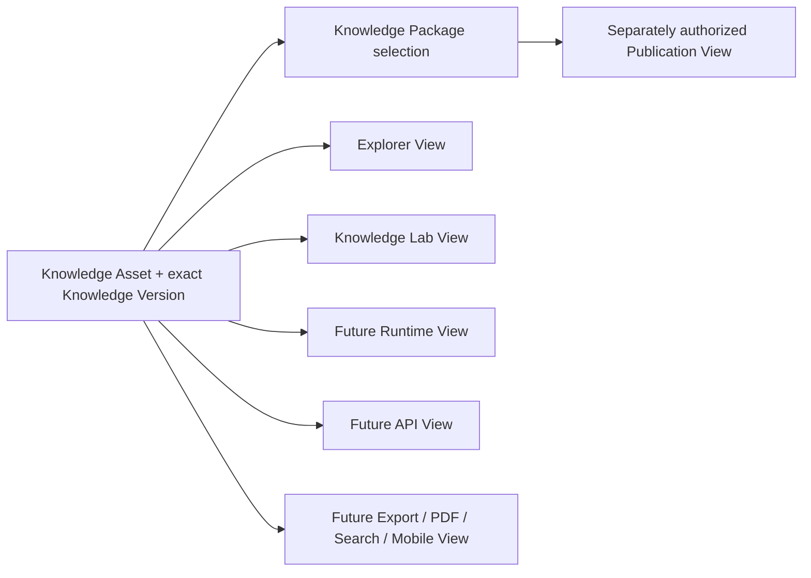

# Representation, Repository, and Evolution Model

Status: Active

Version: 1.0

## Purpose

Define how one Knowledge Asset may have many faithful representations, how
Explorer, Knowledge Lab, a future Runtime, and future delivery channels point to
the same asset, and how the conceptual repository can evolve without binding
knowledge identity to technology.

## One Asset, Many Representations

One Knowledge Asset MAY be expressed through many representations for different
audiences and purposes. Every representation MUST identify or remain traceably
bound to the same stable asset identity, exact Knowledge Version, representation
purpose, representation version, language where applicable, provenance, and
known transformation limitations.

| Representation | Conceptual responsibility | Boundary |
| --- | --- | --- |
| Markdown | Human-readable authoring, review, or documentation expression | A file MUST NOT become identity or universal source of truth by format alone. |
| Knowledge Explorer | Read-side view of appropriately published knowledge | It MUST NOT author, accept, or publish knowledge. |
| Knowledge Lab | Candidate, evidence, review, and governance workspace view | It MUST NOT make candidate or acceptance state authoritative through UI behavior. |
| Future Runtime | Possible machine-operational view of separately mapped knowledge | The current Runtime does not implement this model; mapping requires separate ADR/RAS authority. |
| Future Export | Purpose-specific portable projection | It MUST declare input identity/version and MUST NOT become independent knowledge. |
| Future API | Governed delivery view | It MUST NOT redefine lifecycle, identity, authority, or meaning. |
| Future PDF | Fixed human-readable publication or review view | It MUST preserve exact-version and publication context and MUST NOT imply currency forever. |
| Future Search | Discovery view over governed representations | Ranking and indexing MUST NOT establish truth, authority, equivalence, or recommendation. |
| Future Translation | Language-specific expression of the same semantic basis | It MUST preserve identity and disclose translation review and limitations. |
| Future Mobile | Device-specific interaction and display view | Device behavior MUST NOT create a different asset or governance decision. |

Representations MAY differ in layout, language, density, interaction, and
accessibility. They MUST NOT silently omit a limitation necessary to prevent
misinterpretation, combine incompatible versions, or introduce facts,
inference, diagnosis, recommendation, authority, or publication status.

## Digital Twin Correspondence Model

“Digital twin” in this architecture means governed correspondence among views of
the same asset. It does not mean a selected synchronization technology,
real-time system, duplicated database record, or autonomous model.



The correspondence invariant is:

> Same Asset; exact semantic basis; different governed view; never duplicated
> knowledge.

Each view MUST expose sufficient identity and version context to avoid confusing
another version or asset. A mismatch MUST be reported as a representation or
mapping defect; the views MUST NOT be reconciled by silently copying whichever
one appears newest.

Explorer and Lab MAY present different lifecycle perspectives. Lab may show an
unpublished candidate or review version; Explorer may show an exact published
version. This is not duplication when both remain explicitly linked to their
asset identity and distinct version/state. Explorer MUST NOT imply that Lab
acceptance is publication, and Lab MUST NOT mutate an Explorer publication.

## Conceptual Repository Model

```text
Knowledge Repository
  -> Knowledge Packages
      -> exact Knowledge Asset versions
          -> governed Representations
              -> audience-specific Views
                  -> separately governed Exports or Publications
```

The **Knowledge Repository** is the conceptual custody boundary for governed
Knowledge Assets, Packages, histories, representations, and their connected
evidence and decisions. It is not synonymous with a Git repository, directory,
database, graph, object store, cloud account, or current Python package.

Repository ownership MUST be separated conceptually:

- knowledge governance owns asset meaning and knowledge lifecycle rules;
- identity authorities own identifier families and namespace policy;
- asset stewards own accountable semantic custody within delegated scope;
- package owners own package purpose, exact membership, and history;
- evidence and source custodians preserve traceability, rights, and integrity;
- review authorities own findings and decisions within their competence;
- representation owners preserve faithful audience-specific expression;
- publication authorities own exact release authorization and disposition; and
- engineering owners MAY later own infrastructure without acquiring semantic,
  scientific, review, or publication authority.

A repository location MUST NOT confer any of those authorities. Moving an asset
between future repositories MUST preserve identity, exact versions, provenance,
authority, references, decisions, and audit history.

## Ownership Boundaries

### Runtime Owns

The current Runtime owns only behavior and public contracts authorized by active
RAS and Design Freeze. It does not own Knowledge Asset meaning, knowledge
identity, acceptance, publication, or the conceptual model in this sprint. Any
future mapping MUST be separately approved and MUST NOT retrofit this model into
current Runtime behavior.

### Knowledge Owns

Knowledge governance owns canonical semantic meaning, identity requirements,
evidence and provenance expectations, knowledge versions, lifecycle, conflicts,
and competent review requirements. It does not own rendering technology,
software behavior, deployment, or public repository release permission.

### Knowledge Explorer Owns

Explorer owns a read-side representation and discovery experience for the exact
knowledge versions it is authorized to show. It does not own canonical meaning,
authoring, acceptance, recommendation, or publication decisions.

### Knowledge Lab Owns

Knowledge Lab owns only a possible authoring-and-review workspace
representation. The current static prototype owns fictional UI demonstration
state only. It does not own identity authority, review authority, acceptance,
publication, persistence, authentication, or workflow execution.

### Publication Owns

Knowledge publication governance owns the decision to expose an exact accepted
knowledge release to an audience and channel. Repository publication controls
separately own pushes, tags, releases, artifacts, and packages. Publication does
not own or rewrite asset identity, knowledge meaning, scientific review, or
Runtime behavior.

These ownership scopes MUST NOT overlap by convenience. A handoff MUST reference
the exact identity, version, authority, responsibility, and decision without
transferring powers that were not granted.

## Long-term Evolution

The architecture MUST survive the following conceptual growth without changing
its core identity, version, package, representation, or authority invariants:

1. **Rice Pilot:** a future separately authorized candidate exercise MAY test
   governance while remaining bounded by ADR-008 and ADR-009. This sprint creates
   no Rice content or records.
2. **Crop Protection:** later scopes MAY add independently governed assets and
   packages while preserving epistemic-layer separation and non-recommendation.
3. **Multi Crop:** Rice, Corn, Cassava, Vegetable, Fruit, and other namespaces
   MAY coexist through explicit cross-domain mappings rather than redesign or
   label-based merging.
4. **Global Knowledge Platform:** global and jurisdiction-specific authorities,
   translations, packages, and publications MAY coexist while preserving claim-
   scoped evidence, rights, time, jurisdiction, and audit history.

Completion of one stage MUST NOT authorize the next. Growth MUST occur through
new governed assets, packages, namespaces, mappings, and representations—not by
weakening stable identity or collapsing knowledge categories.

## Future Implementation Options

The following remain possible future implementation choices:

- filesystem-backed custody;
- object-store custody;
- relational or document database;
- graph-oriented storage or projection;
- local, hosted, or cloud infrastructure; and
- combinations with deterministic import, export, migration, and audit controls.

No option is selected or preferred here. Future proposals MUST demonstrate
equivalent preservation of identity, versions, provenance, references, rights,
review, publication state, history, and boundaries. Technology choice MUST NOT
change what the Knowledge Asset is.

## Fictional Example

Fictional asset **K-Prism V-Five** is shown as a Markdown review note in Lab, a
Thai card in Explorer after a separate fictional publication, and a hypothetical
mobile summary. Package **P-Horizon V-Two** selects K-Prism V-Five. All views
point to the same asset and exact semantic basis. A redesigned card creates a new
Representation Version only; it does not change K-Prism or P-Horizon.

This example contains no real crop, organism, disease, product, pesticide,
diagnosis, recommendation, production identifier, or publication action.

## Non-examples

- Maintaining an unrelated “Explorer copy” and “Lab copy” of one claim.
- Letting a search index decide the canonical version.
- Treating a future API payload as a new Knowledge Asset.
- Allowing a database owner to approve scientific meaning.
- Treating a repository push as knowledge publication.
- Selecting a graph because the conceptual object graph uses arrows.

## Change Control

A material change to these invariants requires knowledge-architecture review,
impact analysis across the Constitution, ADRs, KAS, KGS, Design Freeze, RAS,
Source Policy, and Publication Boundary, explicit competent approval, a new
document version, and preserved supersession history. Later implementation MUST
conform to this architecture; it MUST NOT silently redefine it.
