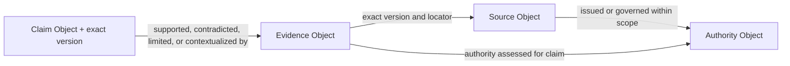

# Evidence Traceability Graph

Status: Active

## Purpose

Show how a Claim traces to evaluated Evidence, exact Source content, and scoped
Authority.

The arrows record asserted traceability, not truth propagation. Source authority
is claim-, jurisdiction-, version-, and time-scoped. Evidence MUST NOT inherit
universal authority, and a Claim MUST NOT be inferred from source presence.

This graph is conceptual and creates no score, ranking, extraction pipeline, or
machine edge.
