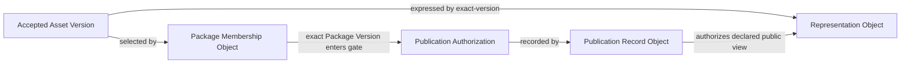

# Publication and Representation Graph

Status: Active

## Purpose

Separate accepted Asset meaning, Package selection, publication authorization,
publication history, and audience representation.

Publication Authorization is a competent governance decision referenced by the
Publication Record; it is not inferred from membership or acceptance. A
Representation MUST NOT create a new Asset, and public reachability MUST NOT
substitute for a Publication Record.

This graph defines no deployment, tag, release, package upload, or delivery code.
