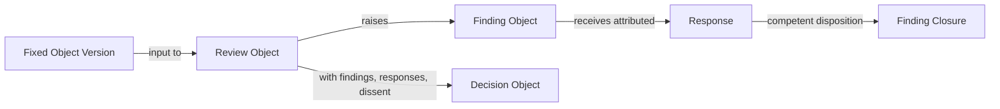

# Review and Decision Graph

Status: Active

## Purpose

Separate review activity, specific findings, responses, closure, and formal
decisions for a fixed Object Version.

Response and closure are governed parts of review history; they need not be new
object classes. Comment is not Finding, Finding closure is not acceptance,
Review is not Decision, and Decision is not Publication. No missing step may be
inferred from UI status or elapsed time.

This diagram defines no workflow engine, automated decision, or permission model.
