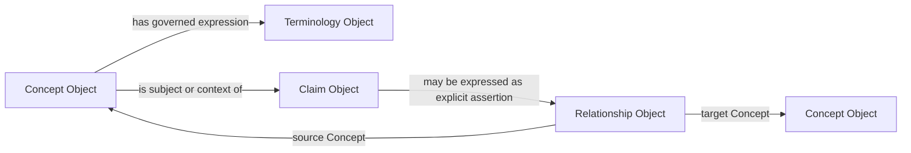

# Scientific Meaning Graph

Status: Active

## Purpose

Show asserted links among scientific-meaning objects without implementing a graph.

Every link is an explicit governed reference. Bidirectional navigation MUST NOT
imply symmetric meaning. No inverse, causal, transitive, equivalence, diagnostic,
or recommendation edge may be inferred. A future inferred link would require a
separate authorized inference architecture; inference remains prohibited here.

This diagram defines no graph database, ontology language, schema, or Runtime.
