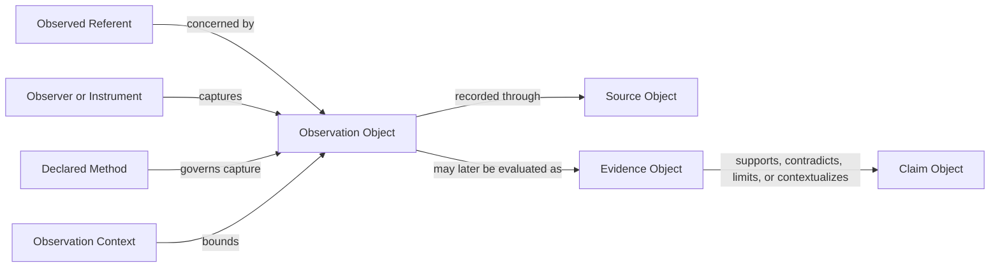

# Observation Ontology

Status: Active

Version: 1.0

## Purpose

Define the conceptual meaning and relationships surrounding Observation without
selecting an ontology language or graph implementation.

## Ontological Position

Observation belongs to the observations-and-cases layer established by ADR-002
and the Ontology Principles. It is time- and context-bound. It MUST remain
separate from the identity of the observed entity, general Concept meaning,
Evidence assessment, Claim meaning, causal or diagnostic reasoning, regulation,
safety, recommendation, decision, and action.

## Conceptual Participants

- **Observation Object:** the governed account of one capture event.
- **Observed referent:** the entity, event, process, property, or explicitly
  unresolved subject toward which capture was directed.
- **Observer:** the attributable human, group, instrument, or declared combined
  responsibility that performed or reported capture.
- **Method:** the declared way capture was conducted.
- **Result:** what was reported, perceived, measured, counted, imaged, or captured.
- **Context:** conditions necessary to interpret the bounded account.
- **Provenance:** origin, custody, transformations, versions, and review history.

These participants describe conceptual roles. They do not prescribe classes,
fields, cardinality, or storage.

## Permitted Asserted Relationships

An Observation MAY explicitly state that it:

- concerns an identified or unresolved referent;
- was captured by an attributed observer or instrument;
- used a declared method;
- occurred within a declared temporal and situational Context;
- produced or reported a descriptive Result;
- was recorded in or nominated through an exact Source;
- was derived from another Observation through a declared non-semantic
  transformation; or
- was evaluated by a later Evidence Object for a precise Claim.

Each relationship MUST be asserted, scoped, version-aware, and traceable. A UI
link, co-occurrence, common label, spatial proximity, repeated value, or graph
path MUST NOT create a relationship.

## Boundary Relationships

The arrows are asserted conceptual relationships, not executable graph edges.
No path licenses inference. In particular, Observation to Evidence to Claim MUST
NOT be shortened into Observation proves Claim.

## Observation Versus Property

A captured value is contextual to the Observation. It MUST NOT silently become
an intrinsic property of a Concept or universal characteristic of a referent.
Repeated observations MAY remain multiple contextual accounts; aggregation
requires a separately reviewed method and MUST NOT manufacture general meaning.

## Explainability and Human Review

The ontology MUST make role boundaries visible so a reviewer can explain whether
a statement belongs to capture, source custody, evidence assessment, Claim
meaning, or later governance. Ambiguous role assignment MUST remain unresolved.

## Crop Independence

The participant roles and relationships MUST remain usable for any domain.
Domain-specific Concepts, Terminology, methods, and contexts MAY be referenced,
but no crop-specific hierarchy or master data is created here.

## Prohibited Ontological Transitions

Observation MUST NOT imply diagnosis, recommendation, hypothesis, causality,
efficacy, safety, regulation, typicality, equivalence, or prediction. Future
inference would require separate authority and is not part of this architecture.

## Future Implementation Considerations

RDF, OWL, property graphs, relational models, document models, and filesystem
representations remain unselected. Any future mapping MUST preserve asserted
versus inferred distinction and every epistemic boundary.
